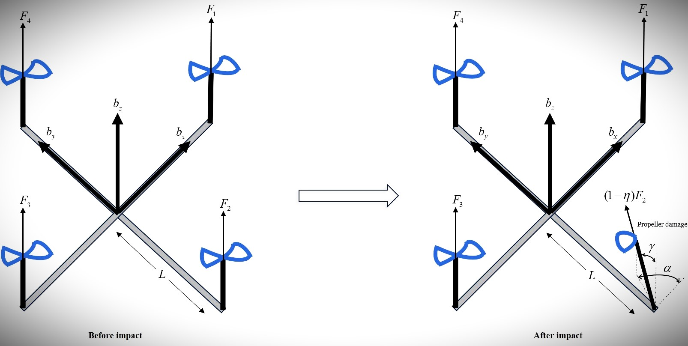

# 🚀 Active Fault-Tolerant Adaptive Non-singular Fast Terminal Sliding Mode Control of a Quadrotor UAV with Motor Thrust Deviation and Actuator Fault

This project focuses on the active fault-tolerant control of a quadrotor UAV encountering both actuator and structural faults, simultaneously. Several simulations have been performed indicating the incredible robustness of the proposed control method of Active Fault-Tolerant Adaptive Nonsingular Fast Terminal Sliding Mode Control (A2NFTSMC).

We have developed a novel **Active Fault-Tolerant Adaptive Non-singular Fast Terminal Sliding Mode Control** integrated with a **Fault Detection and Identification (FDI)** unit, aiming to achieve trajectory tracking and fault reconstruction. A number of simulations performed in MATLAB for small and severe faults demonstrate the remarkable capability of the proposed control framework in trajectory tracking and path following, exhibiting rapid convergence

---------------------------------------

## 📝 A Perspective of the Control Objectives

- **Fault Modeling and Dynamics**  
  - Novel motion equations are derived for a quadrotor UAV subjected to simultaneous actuator and structural faults.  
  - These faults significantly alter the nonlinear dynamics of the system, requiring advanced control strategies to ensure stability and performance.  
  - The proposed framework incorporates fault effects directly into the system model to enable accurate analysis and compensation.  

- **Proposed Control Strategy (A2NFTSMC + FDI)**  
  - An Active Fault-Tolerant Adaptive Non-singular Fast Terminal Sliding Mode Control (A2NFTSMC) is designed to ensure trajectory tracking despite faults.  
  - A Fault Detection and Identification (FDI) unit is integrated for fault reconstruction and timely detection of combined failures.  
  - Adaptive tuning of sliding mode switching gains improves robustness while minimizing overshoots under sudden and severe faults.  

- **Performance and Validation**  
  - Simulation results confirm effective trajectory tracking and fault accommodation in both small and severe fault scenarios.  
  - The FD unit achieves accurate detection of combined faults with a detection delay of about 0.4 seconds.  
  - Comparative studies show that the proposed controller achieves faster convergence and better disturbance rejection than other benchmark controllers.  

--------------------------------------------

## ⚙️ Fault Description and System Dynamics

There exist probable conditions during flight in which quadrotors may experience a collision with other aircraft, a tree, or another object. This impact causes the PLOE of a motor due to the propeller damage and the deviation of the motor. Consequently, the faulty motor force no longer acts in the vertical direction, and its effectiveness will also be reduced. Hence, actuator and structural faults are inevitable. As a result, quadrotor dynamics must be accordingly derived to account for both structural fault (motor deviation) and actuator fault (the effectiveness alleviation of thrust). The demonstration of the aforementioned faults is depicted in the Figure.

According to the the Figure, $\alpha$ and $\gamma$ denote the fault angles, and $\eta$ represents the loss of effectiveness factor of an actuator where $\eta=0$ denotes no actuator fault, $\eta=1$ means the complete failure of an actuator, and $0<\eta<1$ represents the PLOE of an actuator, respectively.
The Assumptions regarding the mathematical modeling are described as follows:

**Assumption 1.** The position of the center of mass is constant after the fault occurrence.

**Assumption 2.** The symmetry of the moment of inertia will not change after the fault occurrence.

**Assumption 3.** After the fault occurrence, the moment of inertia and the mass value of the drone will not change.

The system dynamics of the faulty UAV are expressed as follows:

$$
\begin{aligned}
\ddot{x} &= \left( s_{\phi}s_{\psi} + c_{\phi}s_{\theta}c_{\psi} \right)\frac{F_{1}+F_{2}+F_{3}+F_{4}}{m} 
           - \frac{k_f}{m}\dot{x} + u_{fx} \\
\ddot{y} &= \left( -s_{\phi}c_{\psi} + c_{\phi}s_{\theta}s_{\psi} \right)\frac{F_{1}+F_{2}+F_{3}+F_{4}}{m} 
           - \frac{k_f}{m}\dot{y} + u_{fy} \\
\ddot{z} &= -g + \left( c_{\phi}c_{\theta} \right)\frac{F_{1}+F_{2}+F_{3}+F_{4}}{m} 
           - \frac{k_f}{m}\dot{z} + u_{fz} \\
\ddot{\phi} &= \frac{I_y - I_z}{I_x}\dot{\theta}\dot{\psi} + \frac{J_{TP}}{I_x}\dot{\theta}\Omega 
           + \frac{L(F_4 - F_2)}{I_x} - \frac{k_t l}{I_x}\dot{\phi} + u_{f\phi} \\
\ddot{\theta} &= \frac{I_z - I_x}{I_y}\dot{\phi}\dot{\psi} - \frac{J_{TP}}{I_y}\dot{\phi}\Omega 
           + \frac{L(F_3 - F_1)}{I_y} - \frac{k_t l}{I_y}\dot{\theta} + u_{f\theta} \\
\ddot{\psi} &= \frac{I_x - I_y}{I_z}\dot{\phi}\dot{\theta} 
           + \frac{d}{bI_z}(F_1 - F_2 + F_3 - F_4) 
           - \frac{k_t l}{I_z}\dot{\psi} + u_{f\psi}.
\end{aligned}
$$

$$
\begin{aligned}
u_{fx} &= \left( s_{\phi}s_{\psi} + c_{\phi}s_{\theta}c_{\psi} \right)\frac{F_2}{m}\big((1-\eta)c_{\gamma} - 1\big) 
          + \frac{F_2}{m}c_{\psi}c_{\theta}s_{\gamma}c_{\alpha}(1-\eta) \\ 
       &\quad + \left(-s_{\phi}c_{\psi} + c_{\phi}s_{\theta}s_{\psi}\right)\frac{F_2}{m}(1-\eta)s_{\gamma}c_{\alpha}, \\
u_{fy} &= \left(-s_{\phi}c_{\psi} + c_{\phi}s_{\theta}s_{\psi}\right)\frac{F_2}{m}\big((1-\eta)c_{\gamma} - 1\big) 
          + \frac{F_2}{m}s_{\psi}c_{\theta}s_{\gamma}c_{\alpha}(1-\eta) \\ 
       &\quad + \left(c_{\phi}c_{\psi} + s_{\phi}s_{\theta}s_{\psi}\right)\frac{F_2}{m}(1-\eta)s_{\gamma}s_{\alpha}, \\
u_{fz} &= \left(c_{\phi}c_{\theta}\right)\frac{F_2}{m}\big((1-\eta)c_{\gamma} - 1\big) 
          - \frac{F_2}{m}s_{\theta}s_{\gamma}c_{\alpha}(1-\eta) 
          + s_{\phi}c_{\theta}\frac{F_2}{m}(1-\eta)s_{\gamma}s_{\alpha}.
\end{aligned}
$$

$$
\begin{aligned}
u_{f\phi} &= (1-\eta)\frac{F_2}{I_x}\left(-\tfrac{d}{b}s_{\gamma}c_{\alpha} - Lc_{\gamma} + \tfrac{L}{1-\eta}\right) 
           + \frac{J_{TP}}{I_x}\omega_2\left(\dot{\theta}(1-c_{\gamma}) + \dot{\psi}s_{\gamma}s_{\alpha}\right), \\
u_{f\theta} &= (1-\eta)\frac{F_2}{I_y}\left(-\tfrac{d}{b}s_{\gamma}s_{\alpha}\right) 
           - \frac{J_{TP}}{I_y}\omega_2\left(\dot{\phi}(1-c_{\gamma}) + \dot{\psi}s_{\gamma}c_{\alpha}\right), \\
u_{f\psi} &= (1-\eta)\frac{F_2}{I_z}\left(-\tfrac{d}{b}c_{\gamma} + Lc_{\alpha}s_{\gamma} + \tfrac{d}{b(1-\eta)}\right) 
           + \frac{J_{TP}}{I_z}\omega_2s_{\gamma}\left(\dot{\theta}c_{\alpha} - \dot{\phi}s_{\alpha}\right).
\end{aligned}
$$




------------------
## 🧬 Fault Detection

A Thau observer is designed as the FD unit based on residual generation and evaluation in this section. The conditions for the existence of a Thau observer for the system are as follows:

1. The pair $(A,C)$ must be observable.  

2. The nonlinear continuous function $f(X(t),u(t))$ should be locally Lipschitz, satisfying: 
   $||f(X_2(t),u(t)) - f(X_1(t),u(t))|| \leq \varrho_L ||X_2(t) - X_1(t)||$

where $\varrho_L$ is the Lipschitz constant, and $||.||$ denotes the second norm of a vector or a matrix.  

As a result, the observer can be designed as:  

$$
\begin{aligned}
\dot{\hat{X}}(t) &= A\hat{X}(t) + Bu(t) + f(\hat{X}(t),u(t)) + L\big(y(t) - \hat{y}(t)\big) \\
\hat{y}(t) &= C\hat{X}(t)
\end{aligned}
$$

The observer gain $L$ is defined as:  
$L = P^{-1}C^T$

The positive definite matrix $P$ can be obtained by solving the Lyapunov equation:  
$A^T P + PA - C^T C + \delta P = 0$

in which $\delta > 0$ is chosen such that the equation admits a positive definite solution for $P$.
The adaptive boundaries can be then calculated as follows to form the residuals:

$$r_{ui} = \frac{k_{u1i}}{T_w} \int_{t-T_w}^{t} r_i(\tau)\mathrm{d}\tau + \frac{k_{u2i}}{T_w} \int_{t-T_w}^{t} \left( r_i(\tau) - \frac{1}{T_w}\int_{t-T_w}^{t} r_i(\beta)\mathrm{d}\beta \right) \mathrm{d}\tau + k_{u3i}$$  

$$r_{li} = \frac{k_{l1i}}{T_w} \int_{t-T_w}^{t} r_i(\tau)\mathrm{d}\tau + \frac{k_{l2i}}{T_w} \int_{t-T_w}^{t} \left( r_i(\tau) - \frac{1}{T_w}\int_{t-T_w}^{t} r_i(\beta)\mathrm{d}\beta \right) \mathrm{d}\tau + k_{l3i}$$ 

Once the fault is detected, a nonlinear observer will be utilized to estimate its time-varying nature and use these estimation signals in the control unit to reduce the control efforts:

$$
\begin{aligned}
\hat{u}_{fi}=Z_i+\lambda_iX_j\\
\dot{Z}_i=-\lambda_iZ_i-\lambda_i(\lambda_iX_j+f(X)+g(X)u)
\end{aligned}
$$

where $X_j$ are the measurements of GPS for linear velocities and Gyroscope for angular velocities.

-----------------
## 🎯 Robust Trajectory Tracking and Path Following Control

We may introduce the following non-singular sliding surfaces, for $i=1,3,5,7,9,11$:

$$
s_i = e_i + p_{1i} \text{sign}^{q_{1i}}(e_i) + p_{2i} \text{sign}^{q_{2i}}(\dot{e}_i)
$$

where $p_{2i} > 0$, $p_{1i} > 0$, $1 < q_{2i} < 2$, and $q_{1i} > 1$.  
The control signals along the adaptive laws are calculated by deriving equivalent and switching/fast controllers:

$$
u_{\phi} = \frac{-I_x}{L} \Bigg( p_{2\phi}^{-1} q_{2\phi}^{-1} | \dot{e}_{\phi} |^{(2-q_{2\phi})} \text{sign}(\dot{e}_{\phi}) \big(1 + p_{1\phi} q_{1\phi} |e_{\phi}|^{(q_{1\phi}-1)}\big) - \ddot{\phi}_d + f_{\phi} + k_{1\phi}s_{\phi} + \hat{k}_{2\phi}\text{sign}(s_{\phi}) + \hat{u}_{f\phi} \Bigg)
$$  


$$
u_{\theta} = \frac{-I_y}{L} \Bigg(p_{2\theta}^{-1} q_{2\theta}^{-1} | \dot{e}_{\theta} |^{(2-q_{2\theta})} \text{sign}(\dot{e}_{\theta}) \big(1 + p_{1\theta} q_{1\theta} |e_{\theta}|^{(q_{1\theta}-1)}\big)-\ddot{\theta}_d + f_{\theta} + k_{1\theta}s_{\theta} + \hat{k}_{2\theta}\text{sign}(s_{\theta}) + \hat{u}_{f\theta}\Bigg)
$$  


$$
u_{\psi} = \frac{-bI_z}{d} \Bigg(p_{2\psi}^{-1} q_{2\psi}^{-1} | \dot{e}_{\psi} |^{(2-q_{2\psi})} \text{sign}(\dot{e}_{\psi}) \big(1 + p_{1\psi} q_{1\psi} |e_{\psi}|^{(q_{1\psi}-1)}\big)-\ddot{\psi}_d + f_{\psi} + k_{1\psi}s_{\psi} + \hat{k}_{2\psi}\text{sign}(s_{\psi}) + \hat{u}_{f\psi}\Bigg)
$$  


$$
F_T = \frac{-m}{c_{\phi} c_{\theta}} \Bigg(p_{2z}^{-1} q_{2z}^{-1} | \dot{e}_{z} |^{(2-q_{2z})} \text{sign}(\dot{e}_{z}) \big(1 + p_{1z} q_{1z} |e_{z}|^{(q_{1z}-1)}\big)-\ddot{z}_d + f_{z} + k_{1z}s_{z} + \hat{k}_{2z}\text{sign}(s_{z}) + \hat{u}_{fz}\Bigg)
$$  


$$
u_{x} = \frac{-m}{F_T} \Bigg(p_{2x}^{-1} q_{2x}^{-1} | \dot{e}_{x} |^{(2-q_{2x})}\text{sign}(\dot{e}_{x}) \big(1 + p_{1x} q_{1x} |e_{x}|^{(q_{1x}-1)}\big)-\ddot{x}_d + f_{x} + k_{1x}s_{x} + \hat{k}_{2x}\text{sign}(s_{x}) + \hat{u}_{fx}\Bigg)
$$  


$$
u_{y} = \frac{-m}{F_T} \Bigg(p_{2y}^{-1} q_{2y}^{-1} | \dot{e}_{y} |^{(2-q_{2y})} \text{sign}(\dot{e}_{y}) \big(1 + p_{1y} q_{1y} |e_{y}|^{(q_{1y}-1)}\big)-\ddot{y}_d + f_{y} + k_{1y}s_{y} + \hat{k}_{2y}\text{sign}(s_{y}) + \hat{u}_{fy}\Bigg)
$$  

with the adaptive laws:

$$
\dot{\hat{k}}_{2i}=\sigma_ip_{2i}q_{2i}|\dot{e}_{i}|^{q_{2i}-1}|s_i|         ,$i=x,y,z,\phi,\theta,\psi$
$$

---------------

## 🛠️ Simulation Settings

* **Cost Function:** weighted sum of tracking errors and control inputs, with $P_1=diag([1,1,1,1,1,1])$, $P_2=diag([10,10,10,10,10,10])$.
* **Simulation Time:** 50 seconds.
* **Sampling Time:** $T_s = 0.001$ s.
* **Fault Angles:** $\alpha=20^{\circ}$, $\beta=10^{\circ}$, $\gamma=30^{\circ}$.
* **Initial Conditions:** $X_0=[3,0,1,0,1,0,0,0,0,0,0,0]^T$.

------

## ▶️ How to Use

### 1. Clone this repository:

   ```bash
   git clone https://github.com/MBSajjadi/GANFTSMC_Codes.git
   ```

### 2. Open MATLAB R2022b or newer versions.

### 3. Run `ga` and change settings (if needed) to obtain the optimal control parameters.

### 4. Run the following main scripts:

   * `Main_RBFFNN_GANFTSMC.m` → optimized controller simulation.
   * `PlotComparedResults_GANFTSMC_NFTSMC.m` → comparison plots.
   * `Final_SecondTrajectory.m` → disturbance observer-based TSMC.

* **Main_RBFFNN_GANFTSMC.m**
  Runs the optimized **RBFNN + GANFTSMC** controller.
  Outputs system states, control signals, error signals, and **3D trajectory** of the faulty quadrotor.

* **PlotComparedResults_GANFTSMC_NFTSMC.m**
  Compares the outcomes of the proposed **RBFNN + GANFTSMC** with an **NFTSMC**, specially the angular velocities of the rotors and torques.

* **Final_SecondTrajectory.m**
  Shows results of **Disturbance-Observer-Based TSMC** for additional comparison.

---

## 📊 Results

### 1. Trajectory Tracking

* GANFTSMC achieves accurate path tracking even under rotor deviation.
* NFTSMC shows larger overshoots.

### 2. Control Efforts

* GANFTSMC reduces input magnitudes while maintaining robustness.

### 3. Fault Tolerance

* Trajectory tracking and estimation errors converge to zero in a finite time for DOBTSMC and the proposed GANFTSMC+RBFNN. Still, the reaching time is faster in GANFTSMC.

----------------


